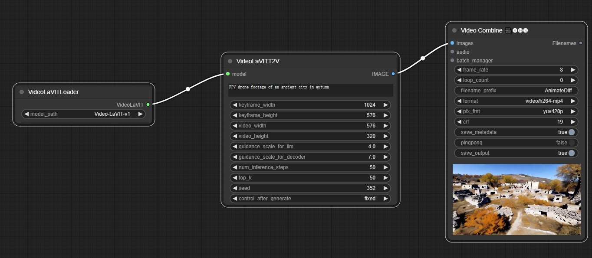
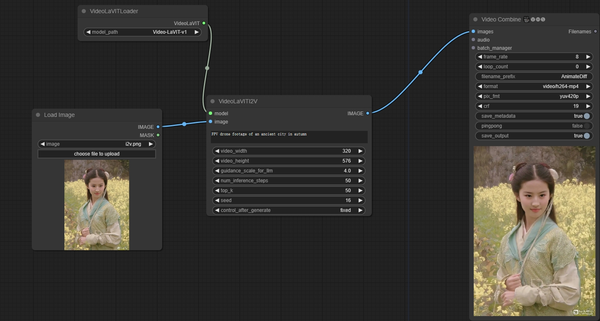
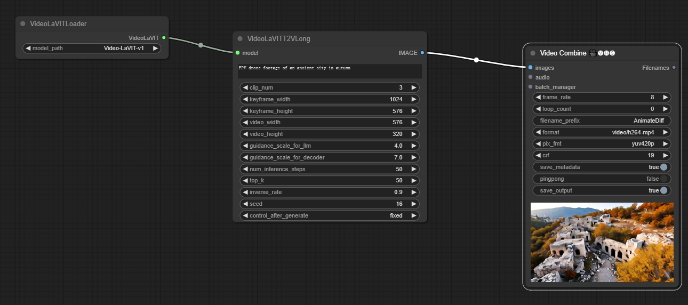
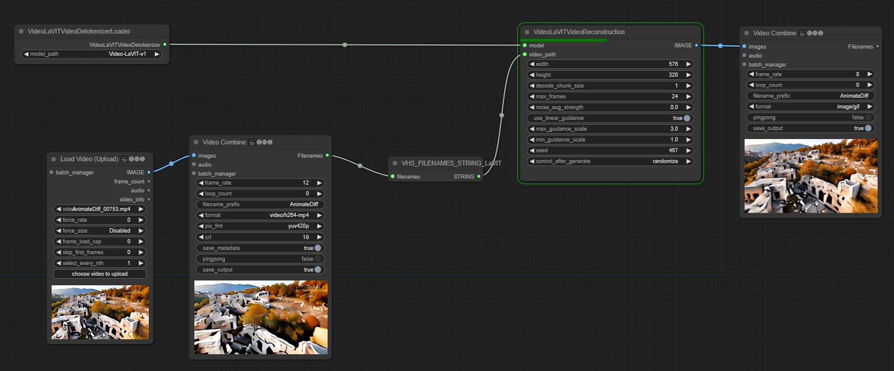

# ComfyUI-LaVIT

## workflow

### T2V

[T2V](https://github.com/chaojie/ComfyUI-LaVIT/blob/main/wf_t2v.json)



### I2V

[I2V](https://github.com/chaojie/ComfyUI-LaVIT/blob/main/wf_i2v.json)



### T2V Long Video

[T2V Long](https://github.com/chaojie/ComfyUI-LaVIT/blob/main/wf_t2v_long.json)



### Video Reconstruction

[Video Reconstruction](https://github.com/chaojie/ComfyUI-LaVIT/blob/main/wf_videoreconstruction.json)



### Model Weights

```
 huggingface-cli download --resume-download rain1011/Video-LaVIT-v1 --local-dir ~/ComfyUI/models/diffusers/Video-LaVIT-v1 --local-dir-use-symlinks False
```

### Notes

Width and height must be multiples of 64

## [LaVIT](https://github.com/jy0205/LaVIT)